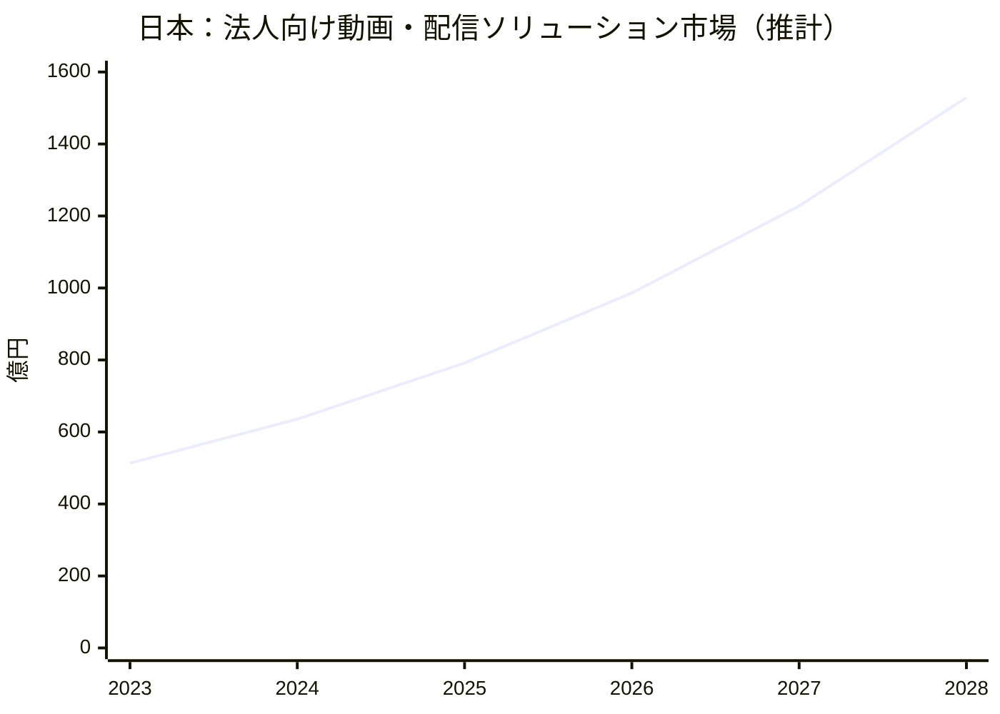
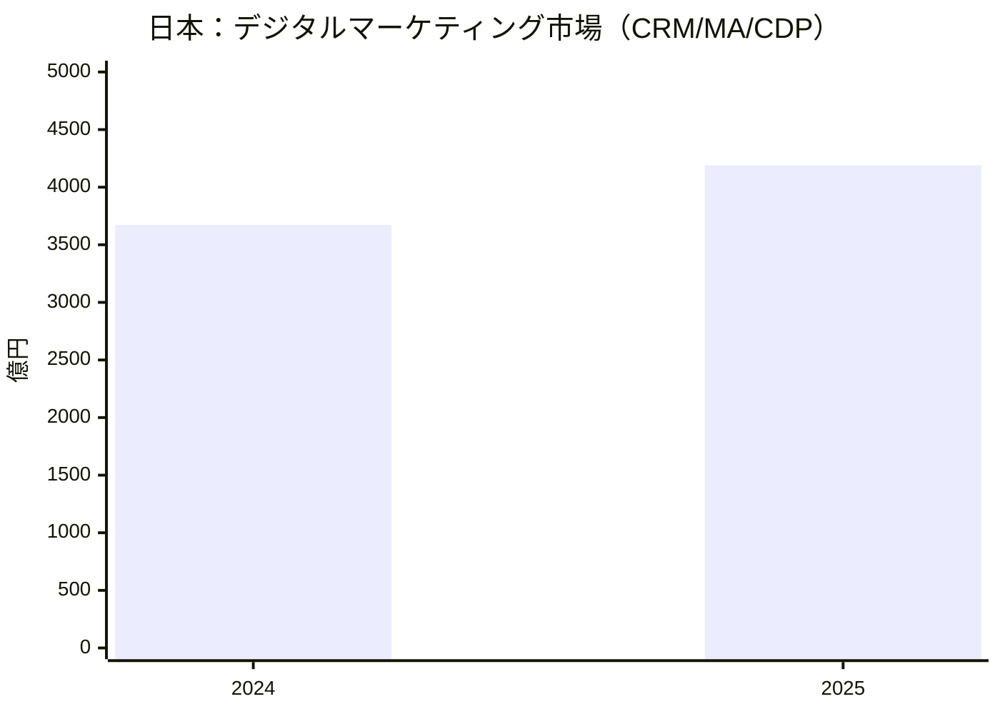
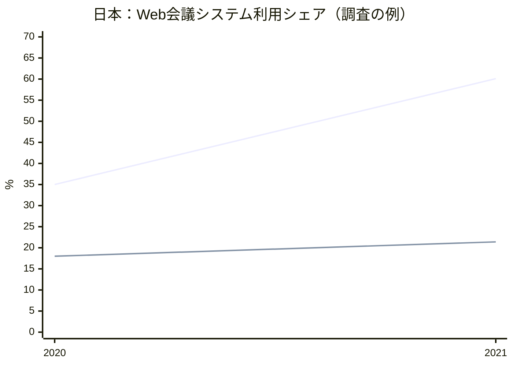
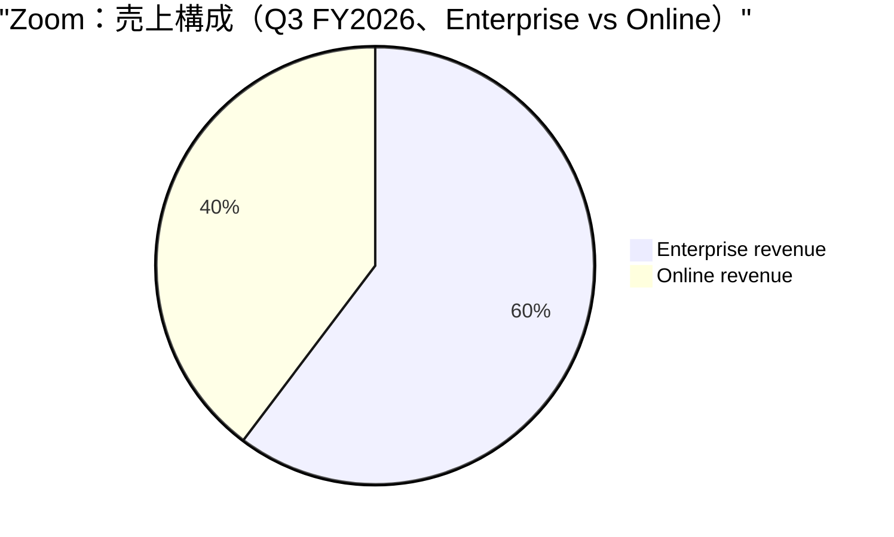
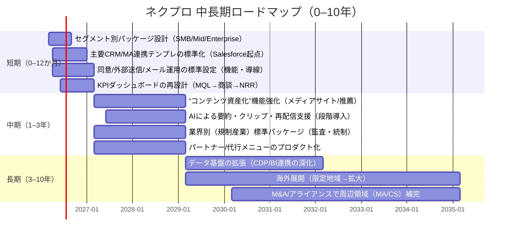

# ネクプロの中長期マーケット戦略に向けた競合分析と比較調査レポート

## エグゼクティブサマリー

ネクプロの中長期マーケット戦略の結論は、「配信ツール」ではなく「B2Bの顧客データ獲得・育成（First-partyデータ）と成果帰属（Attribution）を支える“ウェビナーマーケティング基盤”」として差別化を固定し、①統合（CRM/MA/CDP）と運用自動化、②コンテンツ資産化（オンデマンド・メディア化）とAIによる再利用、③規制・セキュリティ要求に強い業界別ユースケース（縦展開）を、3〜5年で“プロダクトの中心価値”に据えることです。根拠として、国内の法人向け動画・配信関連市場は高い成長が見込まれ（推計値ベース）、同時にデジタルマーケティング（CRM/MA/CDP）市場も拡大とAI機能強化が進み、ウェビナーが「マーケ・営業・CS」全体に組み込まれる可能性が上がっています。citeturn6view0turn34view0

一方で、オンライン会議・配信の“基礎機能”は、汎用プラットフォーム（Zoom/Teams等）の普及によってコモディティ化圧力が強く、単体の配信機能差だけでは中長期の価格決定力が維持しづらい構造です（国内調査でもZoom・Teams利用が突出）。citeturn15search2turn15search0  
したがってネクプロは、（a）登録→メール→参加→視聴ログ→スコア→営業/CS連携までの一気通貫、（b）視聴者体験と運用負荷の最適化、（c）データ/同意・外部送信/メール規制を含むコンプライアンス設計を“製品仕様”として先回りすることで、競合の土俵（単なるウェビナー配信）から離脱する必要があります。citeturn26view1turn34view0turn24view1turn21search20

本レポートは公開情報のみで作成しており、価格・売上・契約数などが非開示の項目は「未公開/不明」と明記しています。citeturn26view0turn33view0

## 対象企業ネクプロの事業分析

ネクプロの結論は、「配信（ライブ/疑似ライブ/オンデマンド）に“申込・メール・アンケート・視聴ログ・会員/コンテンツ管理・外部連携”を統合したB2Bウェビナーマーケティング基盤」であり、さらに運用代行・コンサル・収録支援まで含む“プロダクト＋サービス”の提供形態を前提に設計されている点が、会議ツール型（汎用）と最も異なります。citeturn26view1turn26view0turn25view0

### 事業内容・提供価値・主要サービス

ネクプロの事業概要は、会社案内上「ウェビナーマーケティング・プラットフォームの企画・開発・提供」「運用・保守」に加え、「動画制作支援」「研修」「動画制作」まで含まれています。citeturn33view0turn25view0  
プロダクトとしては、ライブ配信・疑似ライブ・オンデマンドに対応し、申込フォーム/ページ作成、ステップメール、投票・Q&A・チャット、アンケート、視聴ログ分析、コンテンツ保管（ライブラリ）等を備え、配信画面やメールからコンバージョン導線を設置できる構成が明記されています。citeturn26view1turn26view0

外部ツール（ZoomやTeams、OBS等）の映像を「ネクプロを経由して配信」できる仕様は、既存の配信運用資産を活かしつつ、申込・データ・メール等をネクプロ側に寄せるための“統合導線”として重要です。citeturn26view1

### 価格体系・顧客セグメント・販売チャネル・収益モデル

価格体系は、公式上「ライト／プロフェッショナル／マスター」の3プランで、目的に応じた提案・見積もり導線になっており、金額は未公開です。citeturn26view0  
プラン差分として、言語対応（ライトは日本語のみ、上位は英語・韓国語・中国語）、ストレージ容量、管理者アカウント数、SSO（複数方式）、外部システム連携等が列挙されています。citeturn26view0

顧客セグメントは、公式の導入社数として「取引社数400社突破」や管理ID累計「50万ID突破」等が会社沿革に記載され、またプレスリリースでは「導入実績300社以上」と記載があります（時点差により数字が異なる可能性）。citeturn33view0turn25view0  
販売チャネルは、資料請求・見積もり導線が中心であることは確認できますが、代理店販売の有無や比率は未公開/不明です。citeturn26view0

収益モデルは金額・構成比は未公開/不明です。ただし、公式価格ページに「運用代行・カスタマイズ・コンサルティング・配信/収録サポート・ヘルプデスク」など有償オプション群が明示されているため、SaaS利用料に加え、プロフェッショナルサービス収益を組み合わせる設計である蓋然性が高い（推定）と評価します。citeturn26view0

### 技術基盤・セキュリティ・提携・資本関係

セキュリティは、ISMS（JIS Q 27001:2014 / ISO/IEC 27001:2013）の認証取得（2018/2/19付）が明記され、TLS1.2による暗号化、データストレージ暗号化、IP制限・ドメイン排他、電子透かし等の対策が記載されています。citeturn26view1turn26view0

提携（連携）としては、代表的な外部システム連携先にSalesforce、Pardot、HubSpot、Marketoが例示され、申込・視聴・アンケート・資料DL等の行動データを自動連携できる旨が記載されています。citeturn26view1  
また、Salesforce関連ではAppExchange掲載・公式パートナーである旨や、Agentforce連携（ネクプロ for Agentforce）の説明が公開されています。citeturn3search2turn3search3turn3search11

資本関係としては、2021年12月に総額約7.5億円の資本調達計画が公表され、リード投資家としてサファイア・キャピタルが関与したことが、プレスリリースおよび投資家側ニュースで確認できます。citeturn25view0turn25view1  
資金使途として「映像配信基盤・データ分析基盤の強化やAI実装」「マーケ・セールス・CS体制強化」「認知拡大」が示されており、中長期戦略の“投資テーマ”として重要な一次情報です。citeturn25view0

企業沿革では2016年にインフォニック（現INFホールディングス）との経営統合、海外開発センターとして中国・大連、ミャンマー・ヤンゴンに関連会社設立などが記載されています。citeturn33view0  
※技術スタック（クラウド基盤、CDN、DB等）は未公開/不明です。

## 市場環境とマクロトレンド

市場環境の結論は、「動画・配信（イベントを含む）×デジタルマーケティング（CRM/MA/CDP）×AI」により、ウェビナーが“単発施策”から“継続的な顧客接点・データ獲得装置”へ移行する追い風がある一方、会議/配信の汎用機能は統合プラットフォームに吸収されやすく、差別化は「データ・運用・成果」に移る、という二面性です。citeturn6view0turn34view0turn15search0

### 市場規模・成長率の把握

日本の法人向け動画・配信関連市場の代表指標として、デロイト トーマツ ミック経済研究所の推計では「法人向け動画・配信ソリューション市場」が2023年513.3億円、2024年635.7億円、2028年1,529億円（CAGR 24.4%）と示されています。citeturn6view0  
同じく、デジタルマーケティング（CRM/MA/CDP）市場について矢野経済研究所は、2024年3,672億4,000万円、2025年4,190億2,000万円（前年比114.1%）と推計し、拡大要因としてツールの機能進化、多機能化・統合化、AI活用の進展を挙げています。citeturn34view0

グローバルのWeb会議市場については、Mordor Intelligenceのサマリーで2024年63.6億ドル→2029年112.8億ドル（CAGR 12.14%）とされており、ウェビナー基盤が「会議・イベント・動画マーケ領域」と連動して拡大する外部環境を示唆します。citeturn15search8

### セグメント別動向と顧客ニーズ変化

顧客ニーズは「配信の実施」から「配信で得たデータを活かし、部門横断（営業/CS/バックオフィス）で成果につなげる」に移っています。矢野経済研究所は、CRM/MA/CDP等の機能が拡張・融合し、顧客接点業務を包括支援する多機能型・統合型志向が拡大し、利用部門が広がっていると指摘しています。citeturn34view0  
この潮流は、ウェビナー運用における「登録・参加・視聴・行動ログ」を“First-partyデータ”として統合し、スコアリングやパーソナライズを行う基盤価値を押し上げます（ネクプロの外部システム連携・ターゲティングメール・行動データ取得はこの方向性に整合）。citeturn26view1turn34view0

### 規制・法制度の影響

ウェビナー/イベント運営は、①個人情報（申込情報、視聴ログ等）、②外部送信（解析タグやSDK等）、③広告宣伝メール（案内・フォロー）に直結します。

個人情報保護については、個人情報保護委員会が「個人情報保護法ガイドライン（通則編）」等を公表しており、漏えい等報告や安全管理措置など運用ルールが整備されています。citeturn21search0turn21search4  
外部送信（いわゆるCookie規律）については、個人情報保護委員会・総務省のガイドライン解説で、情報送信指令通信の概念（端末に記録された情報を外部に送信させる仕組み）や、送信される情報の内容、送信先等について確認機会を付与する必要性が示されています。citeturn24view1  
広告宣伝メールについては、特定電子メール法（e-Gov法令）により、同意のない送信禁止や表示義務などが規定されています。citeturn21search20turn21search12

これらは「運用注意」ではなく「プロダクト設計（同意、通知、ログ、テンプレ、抑止）」で差を作れる領域であり、ネクプロの中長期差別化の核になり得ます。citeturn24view1turn21search20

### 技術トレンド

技術面では、AIが「運営効率」だけでなく「コンテンツ再資産化」と「意思決定（分析）」を押し上げます。矢野経済研究所は、生成AIを含むAI機能の拡充がデジタルマーケティングツール開発の主眼であるとし、要約、自動応答、コンテンツ自動作成支援などを例示しています。citeturn34view0  
また、ON24はAI機能（ACE）によるARR成長への寄与を公表しており、AIが“追加機能”から“成長ドライバー”に変化している点が示唆されます。citeturn10search14turn8search7

## 競合ランドスケープと選定根拠

競合選定の結論は、「ネクプロと同じ“ウェビナー運用＋マーケ成果”の領域で意思決定される競合」と、「代替により価格圧力を生む“汎用プラットフォーム”」を同時に押さえることです。そのため、国内外から7社を主要競合として選定しました（最低5社要件を満たす）。選定基準は、①市場での利用シェア・普及度、②提供価値の類似性（ウェビナー/イベント/データ）、③成長性（業績・ARR・調達・市場伸長への連動）、④資金調達/資本市場アクセスです。citeturn15search0turn15search2turn10search14turn9search1turn25view0

### 主要競合のプロファイル整理

下表は、各社の「事業内容・提供価値・主要サービス・価格・顧客・チャネル・収益・技術/連携・資本関係」を、公開情報ベースで同一フォーマットに揃えたものです（未公開/不明は明記）。

| 企業 | 事業内容・提供価値 | 主要プロダクト/サービス | 価格体系 | 顧客セグメント | 販売チャネル | 収益モデル | 技術基盤・連携 | 提携・資本関係 |
|---|---|---|---|---|---|---|---|---|
| ネクプロ | - ウェビナーマーケティング基盤（申込・配信・メール・データ） - 動画制作支援/研修等も包含 | - ネクプロ（SaaS） - 運用代行/コンサル/収録支援等オプション | - 3プラン（ライト/プロ/マスター） - 金額は未公開/不明 | - B2B中心（取引社数400社突破等） - 詳細業種比率は未公開/不明 | - 公式は資料請求/見積導線 - パートナー比率は未公開/不明 | - SaaS＋オプション（推定） - 構成比は未公開/不明 | - ライブ/疑似/オンデマンド - 外部配信（Zoom/Teams/OBS等） - CRM/MA連携（Salesforce等） - ISMS、TLS等 | - 2021年に約7.5億の資本調達計画 - 2016年に経営統合の記載 |
| entity["company","Zoom","video comms firm"] | - 会議/配信/イベント基盤 - ウェビナーはアドオンで提供 | - Zoom Webinars（アドオン） - Zoom Events等 | - 公式PDFで月額/年額の階段価格を提示 | - SMB〜Enterprise（グローバル） | - 直販/オンライン購入 | - サブスク中心 | - ウェビナーは最大規模に対応（ライセンスに依存） - AI機能も拡充 | - 公開企業 - 直近四半期で売上成長を公表 |
| entity["company","Microsoft","software company"] | - コラボレーション基盤上でウェビナー/タウンホール | - Teams Webinars - Teams Premium（高度機能） | - Teams Premiumは$10/ユーザー/月（年契約） | - Microsoft 365導入企業（特に中堅〜大企業） | - 直販/パートナー | - サブスク（M365＋アドオン） | - 登録/メール/待機リスト等（Premium） | - 公開企業 |
| entity["company","Cisco","networking company"] | - Webexでウェビナー/イベントを提供 - CRM統合等 | - Webex Webinars - Webex Events | - 公式上は「お問い合わせください」 | - セキュリティ重視の企業/官公庁等 | - 直販/パートナー | - サブスク（推定） | - 最大10万人出席者等 - CRM統合（Salesforce/Eloqua等） | - 公開企業 |
| entity["company","ON24","webinar platform company"] | - ウェビナー/イベント/コンテンツマーケ一体 - AI・分析強み | - Intelligent Engagement Platform（価格は請求） | - Request pricing（非公開） | - エンタープライズB2B | - 直販中心（推定） | - サブスク＋サービス（推定） - ARR開示 | - 20+のインタラクティブツール等 - AI生成・分析を訴求 | - 公開企業 - 2024年業績・ARR等を開示 |
| entity["company","EventHub","event marketing platform"] | - オン/オフ/ハイブリッド一体のイベントマーケ | - EventHub（イベント管理/配信等） | - 公式は見積導線（非公開） | - B2Bイベント実施企業 | - 直販（推定） | - SaaS（推定） | - 参加者データ一元化/QRチェックイン等 | - シリーズAで約6.5億円調達（累計10億超） |
| entity["company","V-cube","japanese vc company"] | - 大規模配信＋運用支援（SaaS＋サービス） | - V-CUBE セミナー等 | - 参考価格350,000円〜（第三者サイト） | - 官公庁/医療等、品質・支援重視 | - 個別提案（推定） | - SaaS＋運用支援サービス型 | - 配信ソフト＋運用設計/当日支援/解析支援 | - 公開企業 |
| entity["company","Innovation X Solutions","japanese saas company"] | - 「ウェビナー専用ツール」簡便性と低価格 | - Cocripo | - 30,000円/月（税抜）等を公式提示 | - SMB中心（推定） | - オンライン/直販 | - サブスク | - 月間利用時間・参加者数でプラン分岐 | - 未公開/不明 |

根拠ソース：ネクプロ（会社案内/価格/機能/資本調達）、Zoom（公式PDF・業績発表）、Microsoft（公式価格・ウェビナー管理資料）、Cisco（公式プランページ・データシート）、ON24（公式価格ページ・IR）、EventHub（公式サイト・資金調達リリース）、V-cube（事業説明資料/第三者価格情報）、Cocripo（公式料金ページ）。citeturn33view0turn26view0turn26view1turn25view0turn25view1turn30search12turn10search15turn27view2turn35search1turn29view0turn8search18turn27view3turn10search14turn27view4turn9search1turn10search16turn10search17turn32view0

## 比較分析

比較分析の結論は、ネクプロの勝ち筋は「動画配信の品質・機能差」ではなく、(1)B2Bのウェビナー運用を“成果が出る型”に落とす（運用の標準化＋自動化）、(2)CRM/MA/CDPへのデータ連携とスコアリング・施策化を核にする、(3)オンデマンド/メディア化でコンテンツを資産化し、AIで再利用を加速する、の3点で強くなることです。citeturn26view1turn34view0turn27view3

### 製品機能比較

| 観点 | ネクプロ | Zoom（Webinars） | Teams（Webinars） | Webex（Webinars） | ON24 | EventHub | V-CUBE セミナー | Cocripo |
|---|---|---|---|---|---|---|---|---|
| 配信形態 | - ライブ/疑似/オンデマンド - 外部ツール映像も経由配信 | - ウェビナー（ビュー専用、規模はライセンス） | - ウェビナー（登録/レポート等） - Premiumで高度機能 | - ライブ/疑似/オンデマンド | - ライブ/疑似/オンデマンド - ブレイクアウト等 | - オン/オフ/ハイブリッド | - 大規模ウェビナーに強み - 運用支援込み | - 動画配信/画面共有等 |
| 申込/登録 | - 申込ページ/フォーム作成 - HTMLカスタム/タグ埋込 | - 申込/登録（一般に提供） | - 登録設定/定員/手動承認等 | - 登録/カスタムページ | - カスタム可能（訴求） | - チケット/参加者管理 | - 個別設計（推定） | - プラン表で機能あり |
| メール運用 | - ステップメール - ターゲティングメール | - 仕様は要確認 | - ウェビナーメール管理（テンプレ/リマインド） | - 自動メール等 | - ナーチャリング/連携（訴求） | - 仕様は未公開/不明 | - 個別（推定） | - 集客/管理機能あり |
| エンゲージメント | - 投票/Q&A/チャット | - チャット/Q&A等（一般） | - Q&A等（Teams） | - 投票（Slido含む） - ブレイクアウト | - 20+インタラクティブ等 | - 交流/チャット等（訴求） | - チャット等 | - チャット/アンケ等 |
| 分析・レポート | - 行動データ取得/グラフ/CSV | - 仕様は要確認 | - 参加/滞在等のレポート | - 仕様は要確認 | - 詳細分析/CTAクリック等 | - データ一元管理（訴求） | - データ測定/解析支援 | - データDLあり |
| CRM/MA連携 | - Salesforce等と自動連携 | - 連携は要確認 | - CRMは別途（要設計） | - Salesforce/Eloqua等 | - リアルタイム連携等（訴求） | - 未公開/不明 | - 未公開/不明 | - 未公開/不明（要確認） |
| セキュリティ/統制 | - ISMS - TLS/暗号化/IP制限等 | - 仕様は要確認 | - M365セキュリティ基盤（一般） | - セキュリティ訴求（一般） | - 企業向け（一般） | - 未公開/不明 | - 安定性・支援訴求 | - 国産・サポート訴求 |

根拠ソース：ネクプロ（機能/価格）、Teams（登録・メール・計画資料）、Webex（機能/CRM統合・投票等）、ON24（機能/分析/AI訴求）、Cocripo（公式プラン表）、V-cube（SaaS＋サービス形態/配信支援）。citeturn26view1turn26view0turn35search3turn35search2turn35search1turn29view0turn8search18turn27view3turn32view0turn10search16  
※Zoomは公式の価格PDFは確認できる一方、機能テーブルとしての一次情報が本調査範囲では限定的なため、一部を「要確認」としています。citeturn30search12

### 価格比較表

| 製品 | 公開されている価格情報 | 備考 |
|---|---|---|
| ネクプロ | 未公開/不明（見積） | 3プラン提示のみ。citeturn26view0 |
| Zoom Webinars | 公式PDF：月額$40（100）〜$6,490（10,000）、年額$400〜$64,900 | 出席者規模で階段。citeturn30search12 |
| Teams Premium | $10/ユーザー/月（年払い） | Teams本体ライセンスが別途必要。citeturn27view2turn8search5 |
| Webex Webinars | 未公開/不明（問い合わせ） | 公式プランページが問い合わせ導線。citeturn29view0 |
| ON24 | 未公開/不明（Request pricing） | パッケージ区分は提示。citeturn27view3 |
| EventHub | 未公開/不明（見積） | 公式は費用見積フォーム。citeturn9search4 |
| V-CUBE セミナー | 参考：350,000円〜（第三者） | 内容により変動。citeturn10search17 |
| Cocripo | 月額30,000円（税抜）/70,000円（税抜）など公式提示 | 月間利用時間（10h/20h）＋参加者数上限。citeturn32view0 |

### ターゲット顧客マトリクス

結論として、ネクプロの主戦場は「ウェビナーを“量産し、データを回して成果（商談・アップセル・CS）を出す”B2B組織」であり、Cocripo（低価格/簡便）やV-CUBE（運用込み大規模）とは“同じウェビナーでも購買理由が異なる”ため、セグメント別に勝ち方を変える必要があります。citeturn26view1turn32view0turn10search16turn33view0

| セグメント軸 | 適合が高い（相対） | 主な判断基準 |
|---|---|---|
| SMB：初めてのウェビナー/低コスト | Cocripo、（Zoomアドオン） | - 月額の明確さ - 立ち上げ容易性 |
| Mid：定期開催＋MA/CRM連携 | ネクプロ、（Teams） | - 登録/メール/ログ - CRM/MA連携・自動化 |
| Enterprise：全社標準+統制 | Teams、Webex、（ネクプロ上位） | - 組織統制/ポリシー - セキュリティ/監査 |
| 大規模イベント：運営込み | V-CUBE、EventHub | - 当日運用/スタジオ/支援 - オン/オフ統合 |
| B2Bマーケ高度化（ABM/コンテンツ戦略） | ON24、ネクプロ（拡張余地） | - 分析/パーソナライズ - コンテンツ資産化/AI |

### チャネル・販売戦略比較

| 観点 | ネクプロ | Zoom/Teams/Webex | ON24 | EventHub/V-CUBE | Cocripo |
|---|---|---|---|---|---|
| 主な購買起点 | - マーケ施策/ウェビナー成果 | - IT標準/会議基盤の延長 | - エンタープライズのマーケ課題 | - イベント運営課題（体制不足） | - 低価格で開始 |
| 営業モデル | - 見積/提案型（推定） | - オンライン購買＋大口直販 | - 直販中心（推定） | - 個別提案＋運用支援 | - サブスク自己導入 |
| 継続の鍵 | - 施策の成果可視化 - 運用自動化 | - 利用習慣＋全社標準 | - 分析/統合の深さ | - 代行品質/安定性 | - 価格/簡便性 |

根拠：各社公式ページ・価格/仕様情報の公開度合い、ならびに国内でのWeb会議利用シェアの調査。citeturn26view0turn29view0turn27view3turn9search4turn10search16turn32view0turn15search0turn15search2

### 主要データのグラフ化

注：2023・2024・2028は公表値、2025-2027はCAGR（24.4%）を用いた補間（推計）。citeturn6view0

citeturn34view0

注：2020年は「利用中/検討中」の調査、2021年は「有料版導入企業の単一回答」の調査であり、厳密な時系列比較ではなく“普及の方向性”の参考。citeturn15search2turn15search0

citeturn10search15

## SWOT分析

SWOTの結論は、ネクプロは「統合された運用・データ・セキュリティ」を強みにできる一方、汎用会議基盤の普及による代替圧力と、価格非公開ゆえの比較検討フェーズでの不利（説明コスト）に直面しやすいことです。citeturn26view1turn26view0turn15search0

| 企業 | Strengths（強み） | Weaknesses（弱み） | Opportunities（機会） | Threats（脅威） |
|---|---|---|---|---|
| ネクプロ | - 申込〜配信〜メール〜分析〜連携の統合 - 外部配信も経由してデータを集約可能 - ISMS等セキュリティを明示 | - 価格が非公開で比較されづらい - 売上/シェア等の外部指標が限定 | - デジマ市場拡大＋AI機能拡充が追い風 - 規制対応を製品仕様にできる | - Zoom/Teams等の代替圧力 - 同意/外部送信/メール規制の違反リスク |
| Zoom | - 世界的普及、拡張性 - 価格体系を公式で提示 | - 会議/ウェビナーは“汎用”で差別化が難しい | - AI需要の拡大、イベント機能拡張 | - 競合統合スイート（M365等） |
| Microsoft | - 企業標準（M365）に内蔵 - Premiumで登録/メール/待機等を強化 | - 高度運用はライセンス設計が複雑化しやすい | - 全社標準化の流れ | - 専門特化型（ON24等）に高度マーケ用途を奪われる |
| Cisco | - 大規模・CRM統合など企業向け要件 | - 価格が非公開で比較されづらい | - セキュリティ重視市場の継続 | - “会議統合”による価格競争 |
| ON24 | - AI/分析/コンテンツ資産化を強く訴求 | - 価格非公開、導入は重めになりがち | - ABM/コンテンツマーケ高度化 | - 2024年は減収など成長鈍化リスク |
| EventHub | - オン/オフ/ハイブリッド統合 - 調達で成長投資余力 | - 価格非公開 - ウェビナー特化の深さは要確認 | - B2Bイベント回帰（対面＋データ統合） | - 汎用ツール＋運用代行で代替される |
| V-CUBE | - SaaS＋運用支援の提供形態 - 大規模・安定運用の訴求 | - 単価が上がりやすい（推定） | - 規制産業の需要 | - 自社内製/汎用ツールでコスト圧力 |
| Cocripo | - 価格明確、導入容易 - 参加者・時間で分かりやすい制約 | - 高度な統合/分析は限定の可能性 | - SMBのウェビナー定着 | - 価格競争、上位市場への拡張性 |

根拠：ネクプロ機能/価格・セキュリティ、Web会議の普及調査、矢野経済の市場拡大とAI、外部送信規律・特定電子メール法、Zoom価格PDF、Teams webinar機能、Webex機能、ON24業績、EventHub資金調達、V-cube事業形態、Cocripo公式プラン。citeturn26view1turn26view0turn15search0turn15search2turn34view0turn24view1turn21search20turn30search12turn35search1turn29view0turn8search18turn10search6turn10search14turn9search1turn10search16turn32view0

## 中長期戦略オプションと実行ロードマップ

戦略提言の結論は、ネクプロが中長期で取るべきは「統合・データ・コンプライアンスに強い“ウェビナー運用OS”化」を中核に、(A)プロダクト強化（AIとデータ基盤）、(B)セグメント集中（業界別・規模別パッケージ）、(C)チャネル拡張（アライアンスと実行支援）を組み合わせることです。矢野経済研究所が示すように、デジタルマーケ市場は多機能化・統合化とAI機能拡充が鍵であり、ネクプロの資金調達目的（映像配信基盤・データ分析基盤・AI実装強化）とも整合します。citeturn34view0turn25view0

### 中長期の戦略オプション

以下は3〜5年／5〜10年を見据えた複数オプションです。コストは公開情報がないため、一般的なSaaS開発・GTM投資のレンジとして概算です（推計）。

| オプション | 狙い（結論） | 3〜5年の重点施策 | 5〜10年の拡張 | 優先度 | 概算コストレンジ（年） | 主リスク | 主な対策 | KPI候補 |
|---|---|---|---|---|---|---|---|---|
| O1：統合＆成果帰属コア | 「視聴ログ→CRM/MA→商談/NRR」を標準化し、解約耐性を上げる | - 連携テンプレ（Salesforce等）標準化 - 웨ビナー施策の“型”を製品内に実装 | - CDP/データクリーンルーム連携（将来） | 高 | 50,000,000〜200,000,000円 | データ品質/導入負荷 | - 導入オンボード標準化 - “推奨設定”の自動化 | - 連携利用率 - MQL→SQL転換率 - CAC回収月数 |
| O2：コンテンツ資産化＆AI工場 | ウェビナーを「継続的に価値を生む資産」に変える | - 収録→要約→クリップ→配信を自動化（生成AI） - メディアサイト機能を強化 | - 企業内ナレッジ連携（検索/推薦） | 高 | 80,000,000〜300,000,000円 | AIコスト/品質 | - 人手レビュー導線 - 利用量に応じた課金 | - コンテンツ再利用回数 - 視聴完了率 - 資料DL率 |
| O3：規制産業向け縦展開 | 情報統制・監査・同意を“売り”にする | - 外部送信/同意/ログ/監査の機能強化 | - 官公庁/医療等の標準化パッケージ | 中 | 30,000,000〜150,000,000円 | 営業サイクル長期化 | - パートナー/SI連携 - 導入事例の型 | - 導入リードタイム - 監査要件適合率 |
| O4：サービス×パートナー拡張 | 代行・伴走を再現性あるメニューにし、導入障壁を下げる | - 運用代行をプロダクト化（テンプレ/QA） | - グローバル/地域パートナー網 | 中 | 30,000,000〜200,000,000円 | 属人化 | - 標準手順/教育 - SLO設計 | - NPS/満足度 - 運営工数削減 |
| O5：海外展開（段階） | 多言語・時差・文化の壁を越えた需要を獲得 | - 重点地域を限定して検証 | - APACでのプロダクトローカライズ | 低〜中 | 100,000,000〜500,000,000円 | 現地競争/法規制 | - 現地代理店 - 先行業界特化 | - ARR（海外） - 継続率 |

### 市場シナリオ分析と戦略適合性

シナリオは最低2つ要件に対し、ここでは3つ示します（ベース/楽観/悲観）。

| シナリオ | 前提 | 起こりやすい変化 | 適合するオプション | コメント |
|---|---|---|---|---|
| ベースケース | デジマ市場は堅調拡大、AI機能が一般化 | - 統合化/多機能化の競争が加速 | O1・O2 | 市場の主流トレンドと一致。citeturn34view0 |
| 楽観ケース | 動画・配信市場が高成長継続、投資が前倒し | - ウェビナーが“標準営業接点”に | O1・O2・O4 | 7.5億調達の投資テーマとも整合。citeturn6view0turn25view0 |
| 悲観ケース | 広告宣伝/外部送信/個人情報対応が厳格化、予算抑制 | - 運用コスト増、同意・通知負荷増 | O3・O4（＋O1の一部） | コンプライアンス機能が差別化に。citeturn24view1turn21search20turn21search0 |

### 実行ロードマップ

### 再利用可能な評価資産

ID: A-001  
ラベル: [モード:分析] [資産:評価フレーム] [大カテゴリ:戦略] [中カテゴリ:シナリオ適合] [形式:スコアカード] [状態:確定]  

- 用途: 各戦略オプション（O1〜O5）を、シナリオ（ベース/楽観/悲観）ごとに「売上インパクト」「実行難易度」「差別化持続性」「規制耐性」「資本効率（回収期間）」で5段階採点し、優先順位を定量化する。  
- 根拠データとして、本レポートの市場成長・規制・競合比較の事実パートを参照する（例：デジマ市場拡大とAI機能拡充、外部送信規律、Web会議普及の集中）。citeturn34view0turn24view1turn15search0turn6view0